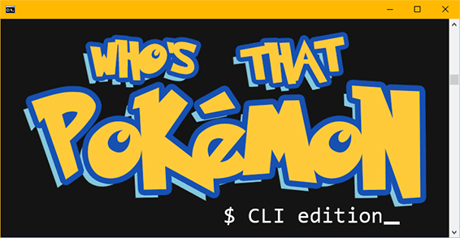

[](https://bflatbader.github.io/)
[](https://www.linkedin.com/in/bishop-bader/)

<p align="center">
    <br>
    <a href="#" target="blank">View Demo</a><br>
</p>

## Overview
A CLI that generates a randomly generates a pokémon to guess from an array of the original 151 pokémon.

## Languages/Technologies Used
- [Node](https://nodejs.org/en/docs/)
    - [Inquirer](https://www.npmjs.com/package/inquirer)
    - [Chalk](https://www.npmjs.com/package/chalk)
    
## Getting Started

### Prerequisites
Have [Node](https://nodejs.org/en/download) installed and run via command line.

### Installation
1. Clone the repo: 
```sh
git clone https://github.com/bflatbader/cli-word-guess-game.git
```
2. Install NPM packages:
```sh
npm install
```

## Usage
To begin, the user should run **index.js** via command line.
```sh
node index.js
```
Then, the user should press a letter on their keyboard and hit Enter. Continue guessing until the pokémon is guessed correctly, or until the number of guesses is depleted.

Once the round is over, the user will be prompted if they'd like to **Play again**, or to **Exit**. 
